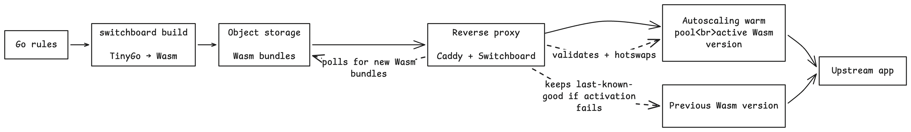

<picture>
  <source media="(prefers-color-scheme: dark)" srcset="docs/public/logo-dark.svg">
  
</picture>

Prototype for programmable reverse proxy rules.

Users write request rules in Go, compile them to WebAssembly with TinyGo, upload immutable bundles to object storage, and proxy instances poll a channel pointer to hot-swap the active rule without restarting the proxy.

Switchboard keeps the long-lived dataplane stable, moves fast-changing request policy into versioned Wasm guests, and activates versions only after validation. It applies that pattern to ordinary reverse proxy deployments instead of requiring a custom CDN or edge network.

Rule deployments do not restart the proxy. Bundles are downloaded, verified, compiled, warmed, and validated off the request path, then activated with an atomic swap. In-flight requests continue using the runtime version they started with. If activation fails, the last known-good version remains active.

```go
func Handle(req sdk.Request) sdk.Action {
	if req.Path() == "/blocked" {
		return sdk.Deny(403).WithReason("blocked-path")
	}

	return sdk.Next().SetRequestHeader("x-powered-by", "switchboard")
}
```

## Architecture



- **CLI**: `init`, `build`, `test`, `eval`, `replay`, `deploy`, `promote`, `rollback`, and more
- **Registry**: S3-compatible object storage, local `file://`, or read-only `https://`
- **Proxy**: Caddy handler module (`http.handlers.switchboard`), standalone `switchboard serve`, or embeddable Go middleware
- **Runtime**: wazero with enforced timeouts, memory caps, and output validation
- **Guests**: TinyGo WASI modules against a small host ABI (`switchboard/v3`)

## Install

```sh
go install github.com/ethndotsh/switchboard/cmd/switchboard@latest
```

Caddy with the module built in:

```sh
docker pull ghcr.io/ethndotsh/switchboard-caddy:latest
# or
xcaddy build --with github.com/ethndotsh/switchboard/caddy@latest
```

You'll also need [TinyGo](https://tinygo.org/getting-started/install/) to build rules.

## Quickstart

No object store required; the `file://` registry works out of the box:

```sh
mkdir my-rules && cd my-rules
switchboard init --name my-rules --registry file://./registry

switchboard build      # compile the rule + embed its tests
switchboard test       # run the behavioral suite
switchboard deploy     # upload + repoint the channel

switchboard serve --listen :8080 --upstream localhost:3000 \
  --registry file://./registry --channel prod
```

Edit the rule, `switchboard build && switchboard deploy`, and the running proxy hot-swaps it within seconds. Broke something? `switchboard rollback --channel prod`.

## Documentation

Full docs live in [`docs/`](docs/): concepts, guides, and a complete CLI/SDK/Caddyfile reference.

```sh
cd docs && pnpm install && pnpm dev
```

Highlights:

- **Quickstart**: first rule to live traffic in five minutes
- **Concepts**: architecture, bundles/channels/revisions, the reliability model
- **Guides**: writing rules, testing, replaying production traffic, deploying, Caddy integration, registries
- **Reference**: every CLI flag, Caddyfile directive, SDK method, and schema

## Examples

Real-world rules, each with a behavioral test suite, under [`examples/`](examples/): auth gating, legacy redirects, security headers, maintenance mode, and metadata-driven canary routing.

## Limitations

Rules cannot read request/response bodies, make network calls, or hold state. That's by design: it keeps decisions deterministic, replayable offline, and predictable when they fail. Switchboard is not a CDN, cache, or hosted control plane. Caddy is the reference adapter.

## Prior art

Architectural lessons from [Railway's Hikari CDN](https://blog.railway.com/p/railway-cdn) (stable dataplane, versioned guests, reconcile + atomic swap) and [Arcjet's production wazero writeups](https://blog.arcjet.com/lessons-from-running-webassembly-in-production-with-go-wazero/) (precompile, never instantiate on the request path).

## License

See [LICENSE](LICENSE).
