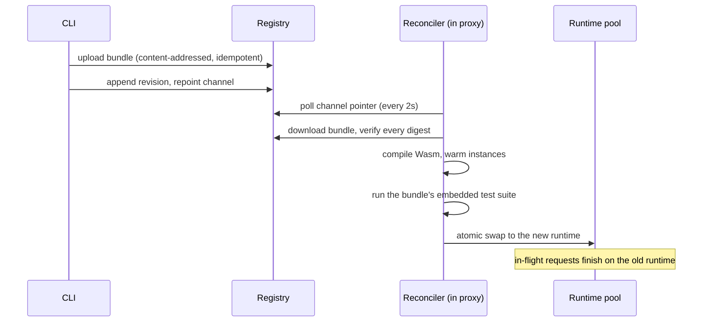

Switchboard splits a proxy into two parts that change at very different speeds:

- The **dataplane**, Caddy (or your own Go server) with the Switchboard handler, is long-lived and boring. It restarts rarely and never as part of a rule deploy.
- The **request policy** (what to block, redirect, rewrite, or tag) lives in small WebAssembly guests that are versioned, tested, and swapped independently.

The registry sits between them. The CLI writes to it; proxies reconcile from it. The two sides never talk to each other directly.

<Frame caption="The CLI writes to the registry; each proxy's reconciler pulls from it and feeds a warm runtime pool.">
  
</Frame>

## The flow of a deploy

Everything on the reconciler side happens **off the request path**; the handler never downloads, compiles, or instantiates anything while serving a request.

## The reconciler

Each proxy runs a background reconciler that continuously drives the actual state (the runtime currently serving) toward the desired state (the bundle the channel points at):

1. **Poll** the channel pointer (`poll_interval`, default 2s). Unchanged pointer, no work.
2. **Download** the bundle's artifacts and verify every digest against the descriptor, and that the stored bundle ID matches the descriptor-derived ID.
3. **Compile** the Wasm module and warm a pool of instances.
4. **Test** the candidate by running its embedded behavioral suite against the exact runtime that would serve traffic.
5. **Swap** atomically. New requests borrow from the new pool; in-flight requests complete on the old one.

A candidate that fails any step is [quarantined](/concepts/reliability#quarantine) and the current runtime keeps serving; registry errors retry with exponential backoff.

## Request execution

At request time the handler converts the incoming request into Switchboard's request shape (zero allocations in the adapter), borrows a pooled Wasm instance, and calls the rule's `handle` export. The ABI is deliberately lazy in both directions:

- **Reads are pull-based.** The guest fetches only the fields it asks for (`req.Path()`, `req.Header("...")`) through host calls, so a rule that only reads the path never pays for header serialization.
- **Writes are patch-based.** The guest emits an action plus a patch (header ops, rewrites, metadata) through host calls, each validated as it arrives.

The pool autoscales between `min_pool_size` and `max_pool_size` (defaults 16–128, configurable). Warm invocations run in single-digit microseconds; see the [README benchmarks](https://github.com/ethndotsh/switchboard#performance-notes) for numbers.

## Sandboxing

Rules execute under [wazero](https://wazero.io) with hard bounds on time, memory, and output; the [execution limits](/concepts/reliability#execution-limits) table has the specifics. Rules have no filesystem, no network, no clock beyond what the ABI exposes, and no state between invocations. What they can affect is exactly one thing: the action returned for the current request. Even that is [validated](/concepts/reliability#output-validation) before it touches anything.

## Where each piece runs

| Piece | Runs | Role |
| --- | --- | --- |
| `switchboard` CLI | your machine, CI | build, test, deploy, promote, rollback |
| Registry | S3-compatible store, local directory, or HTTPS origin | immutable bundles + channel pointers + revisions |
| Caddy module `http.handlers.switchboard` | your edge | reference dataplane adapter |
| `switchboard serve` | anywhere | standalone single-binary proxy |
| `engine` + `adapters/http` | your Go server | embed the same middleware directly |
