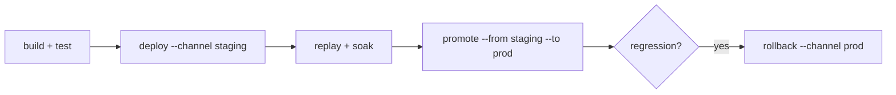

Every deployment operation follows the same shape: append an immutable revision record, then repoint the channel. Nothing is ever overwritten, so the history is a complete, trustworthy audit log.

## Deploy

```sh
switchboard deploy
```

`deploy` uploads the built bundle from `dist` (skipping the upload entirely if the content-addressed bundle already exists), appends a revision, and repoints the channel from `switchboard.yaml`. Override with `--channel`, `--registry`, or `--namespace`, and attach a note with `--message`.

Deploys are **idempotent**: re-running a deploy of unchanged content is a no-op with the same result, which makes it safe to wire into CI unconditionally.

Running proxies pick the change up within their poll interval and take it through the [activation gates](/concepts/reliability#activation-gates) before swapping it in.

## Inspect state

```sh
switchboard status  --channel prod    # pointer + latest revision
switchboard history --channel prod    # the full generation log
switchboard inspect --channel prod    # raw channel pointer JSON
```

```txt Output
GEN  BUNDLE           DEPLOYED_AT           BY      COMMIT   NOTE
42   sha256-ab12cd34  2026-07-16T14:03:11Z  ethan   9f31c2e  tighten admin gate
41   sha256-77aa01bc  2026-07-15T09:41:52Z  ci      1e04b77  weekly redirect sync
```

The deployer identity comes from `SWITCHBOARD_DEPLOYER`, then `GITHUB_ACTOR`, then `$USER`, so CI deploys attribute themselves automatically. `--json` on `status` and `history` emits machine-readable output.

## Diff

Compare any two refs (channels, bundle IDs, or local dist directories):

```sh
switchboard diff prod ./dist           # artifact digest comparison
switchboard diff staging prod --tests  # also cross-run each side's tests against the other
```

`--tests` is the interesting one before a promote: it runs staging's suite against prod's bundle and vice versa, catching contract changes that digest comparison can't see.

## Promote

```sh
switchboard promote --from staging --to prod
```

Promotion copies a channel *pointer*, not an artifact: the bundle that verifiably ran in staging is bit-for-bit the one now serving prod. A typical flow:



## Rollback

```sh
switchboard rollback --channel prod                       # previous different bundle
switchboard rollback --channel prod --to sha256-ab12cd34  # a specific bundle (prefixes ok)
switchboard rollback --channel prod --to-generation 41    # a specific revision
```

Rollback is a **roll-forward**: it appends a new generation pointing at the older content. History is never rewritten, and the rollback itself shows up in `history` like any other deploy. Proxies converge on it exactly the way they converge on a deploy: through the full verify-compile-test gate.

## Concurrent deploys

Two deployers racing to the same channel are serialized by conditional creation of the generation object: `If-None-Match: *` on S3-compatible stores, `O_CREATE|O_EXCL` on file registries. The loser sees the new head and retries. Stores without conditional-write support fall back to stat-then-put emulation with a small race window; MinIO and AWS S3 support conditional writes natively.

## A CI pipeline

```yaml .github/workflows/rules.yaml
- run: switchboard build
- run: switchboard test
- run: switchboard replay ./traffic-sample.jsonl --current prod --candidate ./dist --fail-on-new-denials
- run: switchboard deploy --channel staging --message "${{ github.event.head_commit.message }}"
# promote to prod manually, or on a tag:
- run: switchboard promote --from staging --to prod
```

Set `SWITCHBOARD_S3_*` credentials in the environment; see [Registries](/guides/registries#s3-compatible-object-storage).
